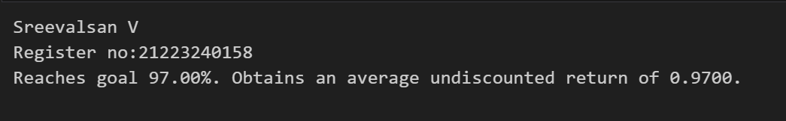

# POLICY ITERATION ALGORITHM

## AIM:
To find an optimal policy for a given MDP and evaluate its performance. It uses the Policy Iteration algorithm to iteratively improve the policy until convergence, resulting in an optimal policy and its associated state-value function.

## PROBLEM STATEMENT:
The problem being addressed in this code is a specific MDP called "Slippery Walk Five." The MDP is defined by its transition probabilities, rewards, and terminal states. The objective is to find a policy that maximizes the expected cumulative reward when navigating from the initial state to a goal state in this MDP.

## POLICY ITERATION ALGORITHM:

**Initialization**:
- Initialize a policy arbitrarily.
- Initialize a value function arbitrarily.

**Policy Evaluation (Prediction):**

- Given the current policy, calculate the state-value function (V) that estimates the expected cumulative rewards starting from each state.
- Iterate until V converges:
  - For each state, update V based on the expected rewards and transitions following the current policy.

**Policy Improvement (Control):**
- Given the current state-value function (V), update the policy to be greedy with respect to V.
- For each state, choose actions that maximize the expected cumulative reward.

**Iteration:**
- Repeat steps 2 and 3 until the policy no longer changes (convergence).


## POLICY ITERATION FUNCTION:
```py
# NAME:SREEVALSAN V
# REGISTER NO:21223240158
def policy_iteration(P, gamma=1.0, theta=1e-10):
    random_actions = np.random.choice(tuple(P[0].keys()), len(P))
    pi=lambda s: {s:a for s, a in enumerate(random_actions)} [s]
    while True:
      old_pi={s:pi(s) for s in range(len(P))}
      V=policy_evaluation(pi,P,gamma,theta)
      pi=policy_improvement(V,P,gamma)
      if old_pi=={s:pi(s) for s in range(len(P))}:
        break
    return V, pi
```

## OUTPUT:





## RESULT:
Thus, policy iteration algorithm is used to iteratively improve the policy until convergence, resulting in an optimal policy and its associated state-value function.
